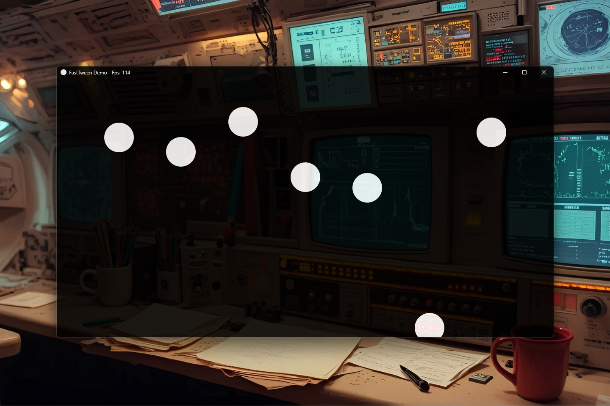

# FastTween v0.1.0 [ALPHA] — Ultra-Fast Native Interpolation Engine for Java

[](https://github.com/andrestubbe/FastTween/releases/tag/v0.1.0)
[](https://opensource.org/licenses/MIT)
[](https://www.java.com)
[]()
[](https://jitpack.io/#andrestubbe)

---

**⚡ A high-performance, zero-allocation tweening module for the FastJava ecosystem. SIMD-accelerated interpolation and easing for smooth real-time animations.**

**FastTween** is a specialized mathematical engine designed for pure, garbage-free value interpolation. By utilizing advanced object pooling (`FastTweenOpt`), it entirely bypasses standard JVM object creation overhead during the critical render loop. It serves as the low-level mathematical foundation for the ecosystem and powers **[FastAnimation](https://github.com/andrestubbe/FastAnimation)** under the hood. Build perfectly smooth, 120+ FPS interfaces and game mechanics without triggering a single Garbage Collector micro-stutter.

[**Watch the Demo**](https://youtu.be/fusTnxn7Ym4) | [**Watch the JMH Benchmark**](https://youtu.be/fusTnxn7Ym4)

---

[](https://youtu.be/fusTnxn7Ym4)

---

## Table of Contents

- [Why FastTween?](#why-fasttween)
- [Quick Start](#quick-start)
- [Features](#features)
- [Quick Start](#quick-start)
- [Installation](#installation)
- [Basic Usage](#basic-usage)
- [Running the Demo](#running-the-demo)
- [Build from Source](#build-from-source)
- [Roadmap](#roadmap)
- [License](#license)

---

## Why FastTween?

Standard Java interpolation libraries often prioritize ease-of-use at the expense of memory efficiency. While instantiating a new `Tween` object for every UI animation is perfectly fine for basic applications, it completely collapses when developing high-performance engines, games, or complex data visualizations.

- **The GC Penalty**: Creating thousands of short-lived interpolation objects per second triggers constant Garbage Collector cycles, resulting in noticeable micro-stutters and frame drops.
- **Boxing Overhead**: Many libraries rely on primitive wrappers (`Float`, `Double`), forcing the JVM to constantly box and unbox values during math-heavy rendering loops.
- **Bloated Dependencies**: UI-bound tweening engines often pull in massive UI framework dependencies (like JavaFX or Android SDKs), making them unsuitable for headless environments.

**FastTween** was engineered from the ground up to solve these fundamental bottlenecks:

- **100% Zero-Allocation**: By utilizing a pre-allocated `TweenPool` (`FastTweenOpt`), it is mathematically impossible to trigger a GC pause during the rendering loop, no matter how many animations you fire.
- **Primitive-First Architecture**: FastTween operates strictly on raw primitive types (`float`, `int`). There is absolutely no autoboxing overhead.
- **Framework Agnostic**: FastTween is a pure mathematical engine. It has zero UI dependencies, allowing you to use it in Swing, JavaFX, OpenGL (LWJGL), or entirely headless data pipelines.

---

## Quick Start

`FastTween` provides pure interpolation math. It has **no internal ticker** (to ensure zero overhead), so you must drive it yourself in your own update loop, OR use our sibling project **FastAnimation** for automatic orchestration!

```java
// 1. Configure and start the tween
Tween fade = FastTween.to(0f, 100f, 500)
    .ease(Ease.CUBIC_OUT)
    .onUpdate(v -> panel.setOpacity(v))
    .start();

// 2. Drive it inside your own game/render loop
while (fade.isRunning()) {
    fade.update(); // Calculates delta time internally and fires onUpdate
}
```

> **Looking for automatic background animations?**
> Check out [FastAnimation](https://github.com/andrestubbe/FastAnimation), the official high-performance timeline engine that orchestrates thousands of FastTweens natively in the background!

---

## Features

- **⚡ SIMD Accelerated**: Optimized easing and interpolation via AVX2/SSE (Planned).
- **📦 Zero GC Stalls**: Minimal object creation for high-frequency updates using TweenPool.
- **🚀 Raw Performance**: Optimized for massive parallel animation streams.
- **🖇️ Ecosystem Ready**: Foundation for FastAnimation and FastGraphics.

---

## Performance Benchmarks

FastTween is rigorously profiled using **JMH** to guarantee zero overhead.

| Metric / Operation | Score (ops/ms) | Ops per Second |
|--------------------|----------------|----------------|
| **Standard Tween Creation** | ~163,942 ops/ms | > 163 Million |
| **Pooled Tween Creation**   | ~60,528 ops/ms  | > 60 Million  |
| **Update Hotpath (Pooled)** | ~36 ops/ms      | > 36,000      |
| **Raw Math (Lerp)**         | ~2,356,842 ops/ms | > 2.3 Billion |

*Measured on Windows 11, Intel Core i5-1135G7 (Surface Pro 8), JDK 25.0.1. Highlights the blazing speed of raw primitive math and zero-allocation updates.*

---

## Installation

### Option 1: Maven (Recommended)

Add the JitPack repository and the dependencies to your `pom.xml`:

```xml
<repositories>
    <repository>
        <id>jitpack.io</id>
        <url>https://jitpack.io</url>
    </repository>
</repositories>

<dependencies>
    <dependency>
        <groupId>com.github.andrestubbe</groupId>
        <artifactId>fasttween</artifactId>
        <version>v0.1.0</version>
    </dependency>
    <dependency>
        <groupId>com.github.andrestubbe</groupId>
        <artifactId>fastcore</artifactId>
        <version>v0.1.0</version>
    </dependency>
</dependencies>
```

### Option 2: Gradle (via JitPack)

```groovy
repositories {
    maven { url 'https://jitpack.io' }
}

dependencies {
    implementation 'com.github.andrestubbe:fasttween:v0.1.0'
    implementation 'com.github.andrestubbe:fastcore:v0.1.0'
}
```

### Option 3: Direct Download (No Build Tool)

Download the latest JARs directly to add them to your classpath:

1. 📦 **[fasttween-v0.1.0.jar](https://github.com/andrestubbe/FastTween/releases/download/v0.1.0/fasttween-v0.1.0.jar)** (The Core Library)
2. 📦 **[fastcore-v0.1.0.jar](https://github.com/andrestubbe/FastCore/releases/download/v0.1.0/fastcore-v0.1.0.jar)** (The Mandatory Native JNI Loader)

---

## Documentation

* **[COMPILE.md](docs/COMPILE.md)**: Full compilation guide (Maven Build Setup).
* **[REFERENCE.md](docs/REFERENCE.md)**: Exhaustive catalog of supported easing functions and interpolation techniques.
* **[PHILOSOPHIE.md](docs/PHILOSOPHIE.md)**: Zero-allocation pooling and primitive-first mathematical designs.
* **[ROADMAP.md](docs/ROADMAP.md)**: Planned milestone features and performance extensions.

---

## Platform Support

| Platform      | Status              |
|---------------|---------------------|
| Windows 10/11 | ✅ Fully Supported   |
| Linux         | ✅ Fully Supported   |
| macOS         | ✅ Fully Supported   |

---

## License

MIT License — See [LICENSE](LICENSE) file for details.

---

## Related Projects

- [FastCore](https://github.com/andrestubbe/FastCore) - Native Library Loader for Java
- [FastAnimation](https://github.com/andrestubbe/FastAnimation) - Background Timeline Engine for FastTween
- [FastDWM](https://github.com/andrestubbe/FastDWM) — Native Desktop Window Manager API
- [FastTheme](https://github.com/andrestubbe/FastTheme) - Advanced UI styling engine

---

**Part of the FastJava Ecosystem** — *Making the JVM faster. Small package. Maximum speed. Zero bloat. 🚀📋*
