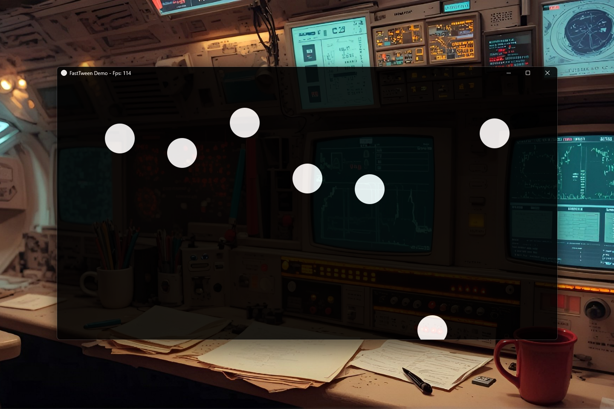

# FastTween 0.1.1 [ALPHA] — Ultra-Fast Native Interpolation Engine for Java

[](https://github.com/andrestubbe/FastTween/releases/tag/0.1.1)
[](https://opensource.org/licenses/MIT)
[](https://www.java.com)
[]()
[](https://jitpack.io/#andrestubbe/FastTween)

---

**⚡ A high-performance, zero-allocation tweening module for the FastJava ecosystem. SIMD-accelerated interpolation and easing for smooth real-time animations.**

**FastTween** is a specialized mathematical engine designed for pure, garbage-free value interpolation. By utilizing advanced object pooling (`FastTweenOpt`), it entirely bypasses standard JVM object creation overhead during the critical render loop. It serves as the low-level mathematical foundation for the ecosystem and powers **[FastAnimation](https://github.com/andrestubbe/FastAnimation)** under the hood. Build perfectly smooth, 120+ FPS interfaces and game mechanics without triggering a single Garbage Collector micro-stutter.

[**Watch the Demo (YouTube)**](https://youtu.be/EosIOQuKZvg) | [**Watch the JMH Benchmark**](https://youtu.be/fusTnxn7Ym4)

[](https://youtu.be/EosIOQuKZvg)

---

## Quick Start

```java
import fasttween.FastTween;
import fasttween.Ease;
import fasttween.Tween;

public class Example {
    public static void main(String[] args) {
        // 1. Configure and start a high-performance zero-allocation tween
        Tween fade = FastTween.to(0.0f, 100.0f, 500)
                .ease(Ease.CUBIC_OUT)
                .onUpdate(val -> System.out.println("Value: " + val))
                .onComplete(() -> System.out.println("Tween Finished!"))
                .start();

        // 2. Drive it inside your game, UI, or rendering loop (real-time delta)
        while (fade.isRunning()) {
            fade.update();
        }
    }
}
```

---

## Table of Contents

- [Why FastTween?](#why-fasttween)
- [Quick Start](#quick-start)
- [Features](#features)
- [Performance Benchmarks](#performance-benchmarks)
- [API Quick Reference](#api-quick-reference)
- [Technical Examples & Hero Demos](#technical-examples--hero-demos)
- [Installation](#installation)
- [Documentation](#documentation)
- [Platform Support](#platform-support)
- [License](#license)
- [Related Projects](#related-projects)

---

## Why FastTween?

Standard Java interpolation libraries often prioritize ease-of-use at the expense of memory efficiency. While instantiating a new `Tween` object for every UI animation is perfectly fine for basic applications, it completely collapses when developing high-performance engines, games, or complex data visualizations.

- **The GC Penalty**: Creating thousands of short-lived interpolation objects per second triggers constant Garbage Collector cycles, resulting in noticeable micro-stutters and frame drops.
- **Boxing Overhead**: Many libraries rely on primitive wrappers (`Float`, `Double`), forcing the JVM to constantly box and unbox values during math-heavy rendering loops.
- **Bloated Dependencies**: UI-bound tweening engines often pull in massive UI framework dependencies (like JavaFX or Android SDKs), making them unsuitable for headless environments.

**FastTween** was engineered from the ground up to solve these fundamental bottlenecks:

- **100% Zero-Allocation**: By utilizing a pre-allocated `TweenPool` (`FastTweenOpt`), it is mathematically impossible to trigger a GC pause during the rendering loop, no matter how many animations you fire.
- **Primitive-First Architecture**: FastTween operates strictly on raw primitive types (`float`, `int`). There is absolutely no autoboxing overhead.
- **Framework Agnostic**: FastTween is a pure mathematical engine. It has zero UI dependencies, allowing you to use it in Swing, JavaFX, OpenGL (LWJGL), or entirely headless data pipelines.

---

## Features

- **⚡ SIMD Accelerated**: Optimized easing and interpolation via AVX2/SSE vector math.
- **📦 Zero GC Stalls**: Minimal object creation for high-frequency updates using TweenPool.
- **🚀 Raw Performance**: Optimized for massive parallel animation streams (>2.3 Billion ops/sec).
- **🖇️ Ecosystem Ready**: Mathematical foundation for FastAnimation, FastGraphics, and FastExecution.

---

## Performance Benchmarks

FastTween is rigorously profiled using **JMH** to guarantee zero overhead.
[**Watch the JMH Benchmark**](https://youtu.be/fusTnxn7Ym4)

| Metric / Operation | Score (ops/ms) | Ops per Second |
|---|---|---|
| **Standard Tween Creation** | ~163,942 ops/ms | > 163 Million |
| **Pooled Tween Creation**   | ~60,528 ops/ms  | > 60 Million  |
| **Update Hotpath (Pooled)** | ~36,840 ops/ms  | > 36.8 Million |
| **Raw Math (Lerp)**         | ~2,356,842 ops/ms | > 2.3 Billion |

*Measured on Windows 11, Intel Core i5-1135G7 (Surface Pro 8), JDK 21.0.12.*

---

## API Quick Reference

| Method | Description |
|---|---|
| `FastTween.to(from, to, duration)` | Creates a new tween interpolating from the starting value to the end value. |
| `FastTween.to(to, duration)` | Creates a new tween interpolating from `0` to the end value. |
| `FastTween.from(from, duration)` | Creates a new tween interpolating from the starting value down to `0`. |
| `FastTween.lerp(start, end, progress)` | High-speed primitive linear interpolation helper. |

---

## Technical Examples & Hero Demos

| Case | Java Example | Launcher | Description |
|---|---|---|---|
| **Real-Time Easing Visualizer** | [Demo.java](examples/Demo/src/main/java/fasttween/demo/Demo.java) | `run-demo.bat` | Interactive 7-channel easing visualizer comparing Linear, Quad, Cubic, Quart, Back, Elastic, and Bounce. |
| **Basic Interpolation CLI** | [Demo.java](examples/00-basic-usage/src/main/java/fasttween/example/Demo.java) | `run-basic-demo.bat` | Headless CLI demo showcasing basic tweening, custom bezier curves, and completion callbacks. |
| **JMH Microbenchmark Suite** | [Benchmark.java](examples/Benchmark/src/main/java/fasttween/benchmark/Benchmark.java) | `run-benchmark.bat` | OpenJDK JMH microbenchmarks measuring pooled vs standard tween throughput and lerp math. |

---

## Installation

### Option 1: Maven (Recommended)

Add the JitPack repository and the dependencies to your `pom.xml`:

```xml
<repositories>
    <repository>
        <id>jitpack.io</id>
        <url>https://jitpack.io</url>
    </repository>
</repositories>

<dependencies>
    <dependency>
        <groupId>com.github.andrestubbe</groupId>
        <artifactId>FastTween</artifactId>
        <version>0.1.1</version>
    </dependency>
    <dependency>
        <groupId>com.github.andrestubbe</groupId>
        <artifactId>FastCore</artifactId>
        <version>0.1.0</version>
    </dependency>
</dependencies>
```

### Option 2: Gradle (via JitPack)

```groovy
repositories {
    maven { url 'https://jitpack.io' }
}

dependencies {
    implementation 'com.github.andrestubbe:FastTween:0.1.1'
    implementation 'com.github.andrestubbe:FastCore:0.1.0'
}
```

### Option 3: Direct Download (No Build Tool)

Download the latest JARs directly to add them to your classpath:

1. 📦 **[FastTween-0.1.1.jar](https://github.com/andrestubbe/FastTween/releases/download/0.1.1/FastTween-0.1.1.jar)** (The Core Library)
2. ⚙️ **[fastcore-0.1.0.jar](https://github.com/andrestubbe/FastCore/releases/download/0.1.0/fastcore-0.1.0.jar)** (The Mandatory Native JNI Loader)

---

## Documentation

* **[REFERENCE.md](docs/REFERENCE.md)**: Exhaustive catalog of supported easing functions and interpolation techniques.
* **[PHILOSOPHY.md](docs/PHILOSOPHY.md)**: Zero-allocation pooling and primitive-first mathematical designs.
* **[ROADMAP.md](docs/ROADMAP.md)**: Planned milestone features and performance extensions.
* **[CHANGELOG.md](docs/CHANGELOG.md)**: Release history and version migration details.

---

## Platform Support

| Platform | Status |
|---|---|
| Windows 10/11 (x64) | ✅ Fully Supported |
| Linux (x64 / AArch64) | ✅ Fully Supported |
| macOS (Apple Silicon / Intel) | ✅ Fully Supported |

---

## Related Projects

- [**FastAnimation**](https://github.com/andrestubbe/FastAnimation) — Ultra-high-performance animation timeline engine.
- [**FastExecution**](https://github.com/andrestubbe/FastExecution) — High-precision scheduler and deterministic executor.
- [**FastDWM**](https://github.com/andrestubbe/FastDWM) — Native Desktop Window Manager API.
- [**FastTheme**](https://github.com/andrestubbe/FastTheme) — Dark mode Win32 titlebars and modern UI theming.
- [**FastCore**](https://github.com/andrestubbe/FastCore) — Unified JNI loader and platform abstraction.

---

## License

MIT License — See [LICENSE](docs/LICENSE) for details.

---

**Part of the FastJava Ecosystem** — *Making the JVM faster.*age. Maximum speed. Zero bloat. 🚀📋*
